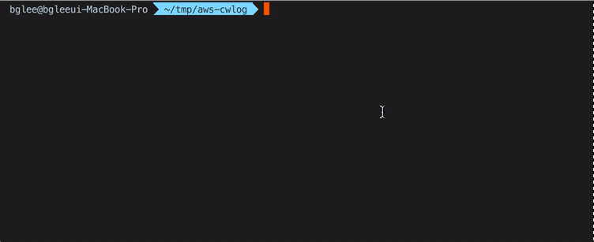

# cwlog

> Download AWS Cloudwatch Logs.



GIF. Please wait a little. 🙏

## Install

<s>cwlog</s> > **aws-cwlog**
```
npm -g i aws-cwlog
```

## Usage

`cwlog`

## Help?

```
$ cwlog --help

...
  --out, -o       log name (default: [group]_[stream].json)
  --region, -r    default: ap-northeast-2
  --tab, -t       JSON tab space (default: 2)
  --profile, -p   🚫 AWS credential profile
  --stdout, -s    🚫 flush stdout
```

## Developed

- Mac
- Node v9.11.1

## License

MIT @_@

